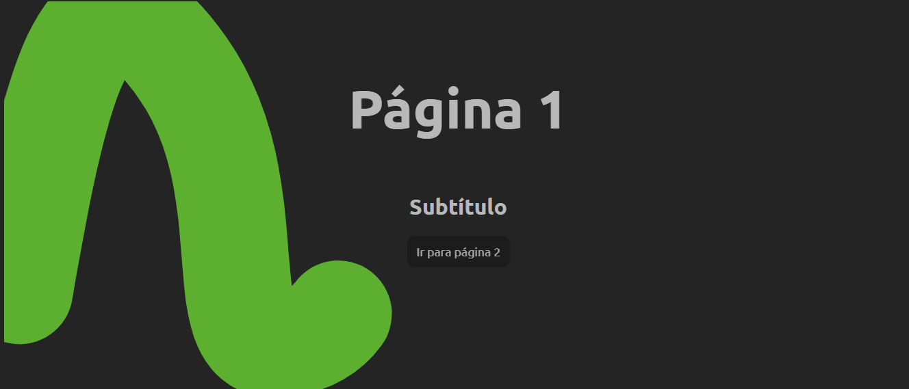

# 🎬 Animated Page Transitions with GSAP + Barba.js



Este projeto cria transições animadas entre páginas utilizando **Barba.js** para gerenciamento de navegação SPA-like e **GSAP** para animações avançadas, incluindo a manipulação de um **SVG personalizado** como elemento principal da transição.

## ✨ Demonstração

O objetivo deste projeto é criar uma experiência de navegação mais fluida e envolvente, substituindo a troca instantânea de páginas por uma animação personalizada baseada em SVG.

## 🚀 Tecnologias Utilizadas

* **HTML5**
* **CSS3**
* **JavaScript**
* **GSAP**
* **Barba.js**

## 📋 Funcionalidades estudadas

* Transições suaves entre páginas.
* Animação de entrada e saída utilizando SVG personalizado.
* Integração entre GSAP e Barba.js para controle preciso do fluxo de animação.

## ⚙️ Instalação

Clone este repositório:

```bash
git clone https://github.com/seu-usuario/page-transition-with-svg.git
```

Acesse a pasta do projeto:

```bash
cd page-transition-with-svg
```

Abra o arquivo `index.html` no navegador:

Ou utilize qualquer servidor HTTP local de sua preferência.

## 🎨 Como Funciona

O fluxo de transição ocorre em três etapas:

1. O usuário clica no link da página inicial .
2. O Barba.js intercepta a navegação.
3. O GSAP executa a animação do SVG personalizado:
4. Animação de saída da página atual;
5. Xarregamento da próxima página;
6. Animação de entrada da nova página.

## 🔧 Personalização

Você pode adaptar facilmente:

* O formato do SVG.
* A duração das animações.
* As curvas de easing do GSAP.
* Os efeitos de entrada e saída.

## 📚 Objetivo do Projeto

Este projeto foi desenvolvido como estudo e demonstração de técnicas modernas de transição entre páginas, explorando a combinação entre animações vetoriais e navegação dinâmica para criar experiências web mais imersivas.
